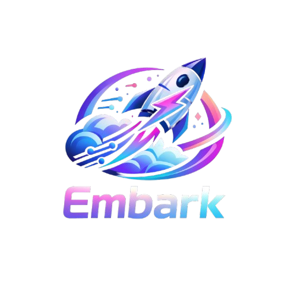

<p align="center">
  
</p>

<p  align="center">
  Ship <strong>vibe-coded apps</strong> with zero-config CI/CD, Docker, and Cloud Run, Netlify or another of your choice deployment.
</p>


<p align="center">
  
  
  
  
  
</p>

## What is Embark?

A monorepo framework that automates everything between **code** and **production**. Create a package, commit, push — it's deployed. Each package in the monorepo is published individually: a push only deploys new or changed packages, not everything.

### Key Concepts

- **One push ≠ deploy everything** — Only packages with actual changes are built and deployed. The rest stay untouched.
- **Each package = its own pipeline** — Every package gets a dedicated GitHub Actions workflow with path filters.
- **Choose your infra** — Cloud Run with auto-generated Docker + CI/CD, Netlify with just a config file, or bring your own. Per package.
- **Zero config** — Workflows, Dockerfiles, and README are auto-generated on commit. You just write code.
- **AI-Powered setup** — Connect your favorite AI (Claude, Gemini, Copilot) to auto-generate Dockerfiles tailored to your stack.
- **Embed anywhere** — Deploy frontend packages to Netlify or static hosts and embed them via `<iframe>` in any system, site, or dashboard.
- **Dev + AI teamwork** — Code with your team while AI handles boilerplate, tests, and deployment pipelines. Stay in control.

## Stack

| Tool | Role |
|------|------|
| [Bun](https://bun.sh) | Runtime, bundler, test runner, package manager |
| TypeScript | Strict mode, no `any` |
| GitHub Actions | Auto-generated CI/CD per package |
| Docker | Auto-generated Dockerfiles (AI or default) |
| Cloud Run | Serverless container deploy |
| Netlify | Static/JAMstack deploy (no Docker needed) |
| Husky | Git hooks (pre-commit & pre-push) |

## Getting Started

```bash
# clone & install
git clone https://github.com/opvibes/embark.git
cd embark
bun install

# initialize (removes demo package, configures upstream remote, removes badges)
bun run init

# create a new package (interactive)
bun run new-package

# commit — automations run automatically
git add . && git commit -m "feat: my new app"

# push — only changed packages deploy
git push origin main
```

> **Forking?** See [Using as a Fork](#using-as-a-fork) for how to pull upstream updates without re-introducing the demo package.

## Creating a New Package

```bash
bun run new-package
```

The CLI will ask for **required fields**:
1. **name** — package name (camelCase or kebab-case)
2. **title** — human-readable title (e.g. "My Awesome App")
3. **subdomain** — subdomain for deployment (e.g. `my-app` → my-app.embark.dev)
4. **description** — package description
5. **deploy target** — Cloud Run, Netlify, or Other

Then creates the complete structure:
- `packages/<name>/` with `src/index.ts`, `package.json`, `tsconfig.json`
- `.embark.jsonc` with all required config fields
- `netlify.toml` (if Netlify was chosen)

Auto-adds to git. Just commit — pre-commit hooks handle workflows, Dockerfiles, and README.

## Deploy Targets

### Cloud Run (default)

Auto-generates a GitHub Actions workflow and Dockerfile. On push, builds a Docker image and deploys to Cloud Run.

```jsonc
// .embark.jsonc
{
  "deploy": "cloud-run",
  "name": "myApp",
  "title": "My App",
  "subdomain": "my-app",
  "description": "My awesome application"
}
```

### Netlify

Two options for Netlify deploys:

**Option 1: Manual deploy (default)** — Connect the repo on Netlify and every push auto-deploys via Netlify UI.

```jsonc
// .embark.jsonc
{
  "deploy": "netlify",
  "name": "myApp",
  "title": "My App",
  "subdomain": "my-app",
  "description": "My awesome application"
}
```

**Option 2: Workflow deploy** — Generates GitHub Actions workflow for CI/CD automation with Cloudflare DNS.

```jsonc
// .embark.jsonc
{
  "deploy": "netlify",
  "workflow": "generate",  // enables workflow generation
  "name": "myApp",
  "title": "My App",
  "subdomain": "my-app",
  "description": "My awesome application"
}
```

With `workflow: "generate"`, the workflow will:
- Build and deploy to Netlify
- Create subdomain on Cloudflare
- Register custom domain in Netlify

### Root Domain Deployment

By default, every package is deployed to a **subdomain** (e.g. `my-app.domain.com`). However, **exactly one** package in the monorepo can be deployed to the **root domain** (`domain.com`) instead.

To enable root domain deployment, set `rootDomain: true` in `.embark.jsonc`:

```jsonc
// .embark.jsonc
{
  "deploy": {
    "appDeployment": "cloudflare-pages",
    "workflowGen": true,
    "cloudflareUse": true
  },
  "name": "myApp",
  "title": "My App",
  "subdomain": "my-app",  // still required, used as fallback identifier
  "description": "My main website",
  "rootDomain": true       // deploys to domain.com instead of my-app.domain.com
}
```

> **⚠️ Important constraints:**
> - Only **ONE** package can have `rootDomain: true` at a time
> - Assigning root domain to a second package will **remove it from the first** (with confirmation)
> - The interactive CLI (`ensure-deploy-config`) will warn you about consequences before confirming
> - `subdomain` is still required even when `rootDomain: true` (used as an identifier)

When configuring packages via `bun run new-package` or during the pre-commit hook, the CLI will:
1. Ask if you want to deploy to the root domain after choosing the subdomain
2. Show a warning that only one package can use root domain
3. If another package already has root domain, show **two confirmation prompts** before replacing it
4. Automatically update the previous package's `.embark.jsonc` to remove its root domain status

### Other (custom)

For packages deployed elsewhere (Vercel, Fly.io, AWS, etc.). No workflow, no Dockerfile — you manage your own pipeline.

```jsonc
// .embark.jsonc
{
  "deploy": "other",
  "name": "myApp",
  "title": "My App",
  "subdomain": "my-app",
  "description": "My awesome application"
}
```

You can **mix all three** in the same monorepo — APIs on Cloud Run, frontends on Netlify, custom infra elsewhere.

## AI CLIs for Dockerfile Generation

When generating Dockerfiles with AI, you can choose your favorite AI provider. Install any (or all) of these CLIs:

### Copilot (GitHub)

```bash
npm install -g @github/copilot
```

### Claude (Anthropic)

```bash
curl -fsSL https://claude.ai/install.sh | bash
```

### Codex (OpenAI)

```bash
npm install -g @openai/codex
```

### Gemini (Google)

```bash
npm install -g @google/gemini-cli
```

**Usage:** When creating a new package or generating a Dockerfile, Embark will ask which AI provider you'd like to use. The CLI will send your `package.json` and file structure to the chosen provider, which will generate an optimized Dockerfile.

## Pre-commit Hooks

On `git commit`, these scripts run automatically:

| Order | Script | What it does |
|-------|--------|-------------|
| 1 | `ensure-deploy-config.ts` | Prompts for missing required fields in `.embark.jsonc` (name, title, subdomain, description, deploy) |
| 2 | `generate-workflows.ts` | Creates GitHub Actions workflow for new packages |
| 3 | `sync-workflows.ts` | Syncs existing workflows with template (preserves `# EMBARK:CUSTOM` blocks) |
| 4 | `cleanup-orphan-workflows.ts` | Removes workflows for deleted/external packages |
| 5 | `generate-dockerfiles-ai.ts` | Generates Dockerfiles (AI or default) |
| 6 | `update-readme-packages.ts` | Updates the packages table in README |

### Customizing Workflows (`# EMBARK:CUSTOM`)

You can add custom steps to a generated workflow without losing them when the template is updated. Wrap your content in `# EMBARK:CUSTOM` markers:

```yaml
    steps:
      - name: Checkout
        uses: actions/checkout@v4

      # EMBARK:CUSTOM
      - name: My custom step
        run: echo "this is never overwritten by sync"
      # END EMBARK:CUSTOM

      - name: Setup Bun
        uses: oven-sh/setup-bun@v2
```

**Rules:**
- Everything between the markers is preserved when `sync-workflows` runs
- The sync compares the workflow **without** custom blocks against the template — if they match, nothing happens (no prompt, no overwrite)
- If the template changed, sync applies the update and **re-inserts** your custom block at the same position
- If the surrounding context line was removed from the new template, your custom block is appended at the end

## Pre-push Hooks

On `git push`, the full test suite runs. Push is blocked if tests fail.

## Structure

```
embark/
├── packages/                  # each folder is an independent app
│   └── embark/                # this website
├── scripts/                   # monorepo automations
│   ├── create-package.ts      # interactive CLI to create packages
│   ├── embark-config.ts       # shared deploy config reader
│   ├── ensure-deploy-config.ts # interactive prompt for missing/incomplete .embark.jsonc
│   ├── generate-workflows.ts  # auto GitHub Actions per package
│   ├── generate-dockerfiles.ts # default Dockerfile generation
│   ├── generate-dockerfiles-ai.ts # AI-powered Dockerfile generation
│   ├── sync-workflows.ts      # sync workflows with template
│   ├── cleanup-orphan-workflows.ts # remove orphaned workflows
│   ├── update-readme-packages.ts   # auto-update README table
│   └── __tests__/             # tests for all scripts
├── templates/
│   └── workflow.template.yml  # GitHub Actions base template
├── .github/workflows/         # auto-generated workflows (1 per package)
└── .husky/                    # git hooks
```

## Scripts

| Script | Command | Description |
|--------|---------|-------------|
| `utils` | `bun run utils` | Unified interactive CLI — access all developer tools from one menu |
| `init` | `bun run init` | Initialize repo for personal use (remove demo, configure upstream) |
| `test` | `bun run test` | Run script tests with coverage |

### Utils CLI Commands

Run `bun run utils` and navigate the menu to access:

| Command | Description |
|---------|-------------|
| `new-package` | Interactively create a new package |
| `new-dockerfile` | Generate Dockerfiles with AI or default template |
| `sync-workflows` | Sync workflows with latest template |
| `init` | Initialize repo for personal use (remove demo, configure upstream) |
| `sync-upstream` | Pull updates from upstream embark, preserving fork customizations |

## Tests

```bash
# run all tests with coverage
bun run test

# run a specific test
bun test scripts/__tests__/create-package.test.ts
```

Coverage threshold: **65%** (configured in `bunfig.toml` — orchestration scripts that call git/bun are integration-level and excluded from unit test coverage)

## Deploy

### Required GitHub Secrets

Configure secrets at **GitHub → Settings → Secrets and variables → Actions**.

#### GCP — Google Cloud Run

Required when `appDeployment: "gcp"`.

| Secret | Description |
|--------|-------------|
| `GCP_PROJECT_ID` | Google Cloud project ID |
| `GCP_SA_KEY` | Service account JSON (deploy permissions) |
| `GCP_REGION` | Cloud Run region (e.g. `us-central1`) |
| `DOMAIN` | Base domain (e.g. `embark.dev`) — used to set the `DOMAIN` env in the workflow |

#### Netlify

Required when `appDeployment: "netlify"`.

| Secret | Description |
|--------|-------------|
| `NETLIFY_TOKEN` | Netlify personal access token |
| `DOMAIN` | Base domain (e.g. `embark.dev`) |

#### Cloudflare (optional, when `cloudflareUse: true`)

Added on top of GCP or Netlify secrets. Required to create/update DNS CNAME records automatically.

| Secret | Description |
|--------|-------------|
| `CF_TOKEN` | Cloudflare API token (with DNS edit permissions) |
| `CF_ZONE_ID` | Zone ID of your domain in Cloudflare |
| `DOMAIN` | Base domain (e.g. `embark.dev`) — must match Cloudflare zone |

### Deploy Flow

```
commit → push to main
  → GitHub Actions detects which packages/ changed
    → Build Docker image (only for changed packages)
      → Push to Artifact Registry
        → Deploy to Cloud Run
```

**Unchanged packages are never rebuilt or redeployed.**

## Using as a Fork

Embark is designed to be forked and used as the base for your own monorepo. After forking:

### 1. Initialize the fork

```bash
bun install
bun run init
```

`bun run init` will:
- Remove the demo package (`packages/embark`) and its workflow
- Remove embark-specific badges from `README.md`
- Configure an `upstream` remote pointing to `opvibes/embark` (push-disabled)
- Enable the `merge.ours.driver` for `.gitattributes` protection

### 2. Pull upstream updates

When embark releases improvements (new scripts, template updates, bug fixes), sync them into your fork:

```bash
bun run sync-upstream
```

This command:
1. Fetches from `upstream`
2. Merges `upstream/main` without committing
3. Automatically removes `packages/embark` and `workflows/embark.yml` if they were re-introduced
4. Normalizes `apps.jsonc`, `package.json` scripts, and README packages table
5. Commits with `chore(upstream): sync changes from embark@<sha>`

### Why not just `git pull upstream main`?

You can, but there are caveats:

| Scenario | `git pull upstream main` | `bun run sync-upstream` |
|---|---|---|
| `merge.ours.driver` not configured | ❌ re-introduces demo files | ✅ always works |
| Demo files already in fork history | ✅ protected by `.gitattributes` | ✅ protected |
| New demo files added in upstream | ⚠️ may re-introduce | ✅ removed automatically |
| Normalizes `apps.jsonc` / `package.json` | ❌ no | ✅ yes |

**Recommendation:** always use `bun run sync-upstream`.

### Commit message conventions

The repo uses [Conventional Commits](https://www.conventionalcommits.org/). The following commit types are automatically **ignored** by commitlint:

- `Merge branch '...'` — local merges
- `Merge pull request #...` — GitHub PR merges
- `Revert "..."` — git reverts
- `v1.2.3` — version bump tags

For your own upstream syncs written manually, use: `chore: pull updates from embark`.

---

## Release (Monorepo Versioning)

When changes are pushed to `main` **outside of `packages/`** (scripts, workflows, templates, docs), a release workflow automatically:

1. **Bumps version** — patch increment (e.g., 1.0.0 → 1.0.1)
2. **Updates `package.json`** — root monorepo version
3. **Updates README badges** — version badge reflects new version
4. **Creates Git tag** — e.g., `v1.0.1`
5. **Creates GitHub Release** — with automatic changelog

> **Note**: Changes inside `packages/` do NOT trigger releases. Each package manages its own versioning independently.

## Packages

<!-- PACKAGES:START -->
| Package | Description |
|---------|-------------|
| `duckflux-docs` | Duckflux documentation |
| `duckflux-site` | Define complex multi-agent pipelines in YAML. Let LLMs do creative work. Let duckflux handle the plumbing. |
| `embark` | Embark your vibe codes applications with a fast deploy and configurations |
<!-- PACKAGES:END -->

### Embark Website

The embark website demonstrates Embark's capabilities with an interactive, fully-animated landing page:

**Features:**
- 🎨 **Interactive Terminal** — Simulate the entire pre-commit pipeline with keyboard navigation (↑↓ arrows + Enter)
- 🎬 **Animated Sections** — Scroll-triggered animations using Three.js, GSAP, and ScrollTrigger
- 📱 **Responsive Design** — Glassmorphism UI with neon accents and dark theme
- 💻 **Real Workflow Visualization** — Side-by-side dual terminals showing Netlify + Cloud Run deployments
- ⌨️ **Keyboard Interactive** — Try different deployment paths with full keyboard support
- 🔄 **Reset Button** — Replay the simulation anytime

**Tech Stack:**
- Vite + vanilla TypeScript
- Three.js for 3D animations
- GSAP + ScrollTrigger for scroll effects
- Custom CSS with CSS variables
- Responsive and performance-optimized

**Running Locally:**
```bash
bun run --filter @embark/embark dev
bun run --filter @embark/embark build
```

---

<p align="center">
  
  Made with vibes by <a href="https://github.com/blpsoares">@blpsoares</a>
</p>
